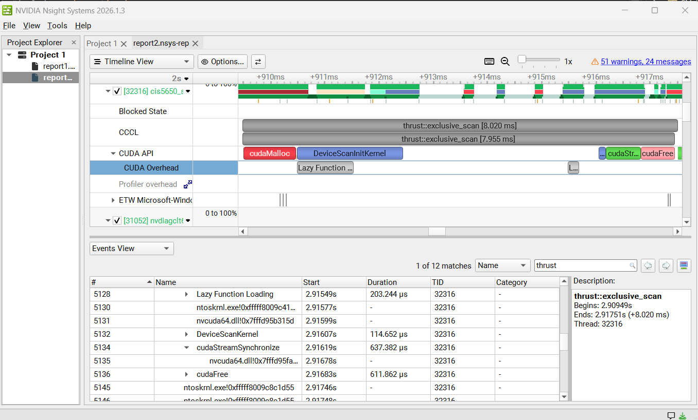

CUDA Stream Compaction
======================

**University of Pennsylvania, CIS 565: GPU Programming and Architecture, Project 2**

* Aidan
* Tested on: Windows 11, i7-1360P @ 2.20GHz 16GB, RTX 4060 128MB

This program does a few different implementations of GPU scan (creating an array of sums) and compact (removing a subset of elements from an array).  It features
- CPU Scan & Compact
- GPU Naive Scan
- GPU Work Efficient Scan as described in [GPU Gems](https://developer.nvidia.com/gpugems/gpugems3/part-vi-gpu-computing/chapter-39-parallel-prefix-sum-scan-cuda)

## Questions

### Thrust Scan Implementation Speculation



An external library called thrust also implements scan.  Since the thrust scan seems to cudaMalloc additional memory, maybe it's a bit different than the work efficient algorithm we learned.  Maybe it uses the additional memory to speed things up in some way.  It also has an ScanInitKernel, which could be an up sweep or something else entirely.  Maybe the thrust scan uses shared memory and a per-block scan.

### Performance Analysis

.png)

- For small array sizes, the problem becomes less parallelizable and the CPU implementation becomes about as fast as the GPU implementations.
- The **naive scan** has to dispatch N threads lgN times, so it's more expensive than the **work efficient** scan, which first dispatches N threads, but then dispatches N/2, and then N/4, N/8...: the up-sweep and down-sweep each require the same number of iterations as the naive scan but we're doing less work per iteration.
- The **work efficient scan** has to pad the array to the nearest size of 2 that encapsulates the array, which I believe is causing the stepped graph formation.  The scan only starts taking more time when the size exceeds a power of 2.  
- Separating the scan into blocks and using shared memory would be better: it'd allow us to sync threads into CUDA without having lg(n) passes and would drastically decrease the number of global memory accesses.  It'd also make it so we don't need to pad the array to the next power of 2.  Maybe the thrust scan does something like this.

### Program Output

```****************
** SCAN TESTS **
****************
    [   3  23  42   0  39   0  16  38   2  47   3  43   3 ...   6   0 ]
==== cpu scan, power-of-two ====
   elapsed time: 55.5135ms    (std::chrono Measured)
    [   0   3  26  68  68 107 107 123 161 163 210 213 256 ... 612254425 612254431 ]
==== cpu scan, non-power-of-two ====
   elapsed time: 56.2082ms    (std::chrono Measured)
    [   0   3  26  68  68 107 107 123 161 163 210 213 256 ... 612254306 612254350 ]
    passed
==== naive scan, power-of-two ====
   elapsed time: 66.0478ms    (CUDA Measured)
    passed
==== naive scan, non-power-of-two ====
   elapsed time: 65.8712ms    (CUDA Measured)
    passed
==== work-efficient scan, power-of-two ====
   elapsed time: 14.7573ms    (CUDA Measured)
    passed
==== work-efficient scan, non-power-of-two ====
   elapsed time: 16.0051ms    (CUDA Measured)
    passed
==== thrust scan, power-of-two ====
   elapsed time: 3.2296ms    (CUDA Measured)
    passed
==== thrust scan, non-power-of-two ====
   elapsed time: 1.93024ms    (CUDA Measured)
    passed

*****************************
** STREAM COMPACTION TESTS **
*****************************
    [   2   0   2   1   2   3   0   1   0   1   3   3   2 ...   2   0 ]
==== cpu compact without scan, power-of-two ====
   elapsed time: 75.1682ms    (std::chrono Measured)
    [   2   2   1   2   3   1   1   3   3   2   2   3   1 ...   2   2 ]
    passed
==== cpu compact without scan, non-power-of-two ====
   elapsed time: 93.0993ms    (std::chrono Measured)
    [   2   2   1   2   3   1   1   3   3   2   2   3   1 ...   1   2 ]
    passed
==== cpu compact with scan ====
   elapsed time: 264.341ms    (std::chrono Measured)
    [   2   2   1   2   3   1   1   3   3   2   2   3   1 ...   2   2 ]
    passed
==== work-efficient compact, power-of-two ====
   elapsed time: 128.059ms    (CUDA Measured)
    passed
==== work-efficient compact, non-power-of-two ====
   elapsed time: 122.393ms    (CUDA Measured)
    passed
Press any key to continue . . .
```

